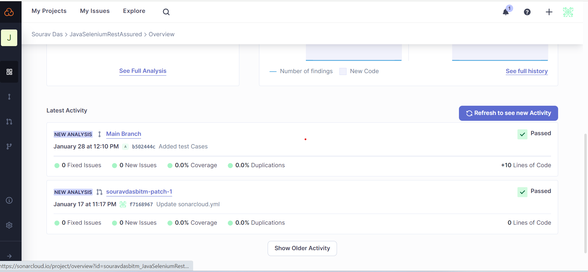

# JavaSeleniumResAssured

This is a framework which is integrated with Cucumber + Selenium + RestAssured (API) + Allure + TestNg

Integrated with https://sonarcloud.io/ for code smells

**How to run**

1. Using maven -> mvn clean test -Denv=<env>  i.e env = staging | qa | dev | preprod.
   Example command : mvn clean test -Denv=staging
2. Run using IDE (Intellij)

    a.Run the cucumber feature file / scenario 

    b.Run the testng.xml file.

